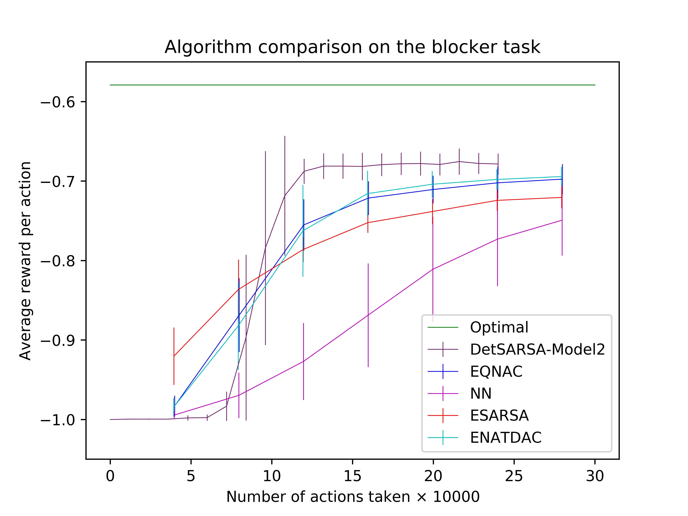

# Determinantal Point Processes for Reinforcement Learning

### Louis Robinson
##### Masters Dissertation Repository

### Determinantal SARSA


Quality           |  Similarity        |  Learning Curve
:-------------------------:|:-------------------------:|:-------------------------:
 |  | 

## Hierarchy
```
.
├── ExamplesOfDPPs
│   ├── PointsInSquare
│   ├── SpanningTrees
│   ├── UnitSphereR4
│   └── RecommenderSystem
├── InteractivePrograms
├── LearningDPPs
└── ReinforcementLearningWithDPPs
    ├── Environments
    ├── root1_Correct-Assumptions
    └── root2_Assumptions-from-Osogami-and-Raymond
```

## Installation
Use the package manager [pip](https://pip.pypa.io/en/stable/) to install the following packages.
- numpy
- matplotlib
- tqdm
- scipy
- pytorch

Replace PACKAGE_NAME with the names in the list.
```bash
pip install PACKAGE_NAME
```

## Running
Replace FILE_NAME with the name of the file you would like to run.
```bash
python FILE_NAME.py
```


## License
[MIT](https://choosealicense.com/licenses/mit/)
